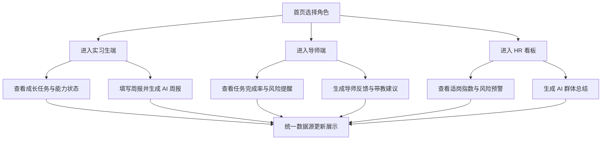

## 1. 产品概述
“实习能量站”是一套面向业务部实习生、导师与 HR 的 AI 成长导航智能看板，用于把任务管理、带教反馈、风险识别和适岗判断整合为一个可视化闭环。
- 解决导师带教不标准、实习生成长路径不清晰、HR 难以统一掌握整体情况的问题
- 面向课程作业场景，优先交付一个可运行、可演示、可部署的网页 Demo

## 2. 核心功能

### 2.1 用户角色
| 角色 | 进入方式 | 核心权限 |
|------|----------|----------|
| 实习生 | 首页角色入口 | 查看成长任务、能力状态、AI 建议、生成周报 |
| 导师 | 首页角色入口 | 查看带教进度、风险提醒、AI 带教建议、生成反馈 |
| HR / 招聘同学 | 首页角色入口 | 查看整体看板、适岗指数、风险预警、群体总结 |

### 2.2 功能模块
1. **首页 / 角色入口**：产品介绍、三角色入口、全局总览指标
2. **实习生端 / 我的成长导航**：状态卡片、本周任务、能力雷达图、AI 成长建议、AI 周报生成
3. **导师端 / 带教工作台**：实习生列表、带教提醒、AI 带教建议、一键生成导师反馈
4. **HR 端 / 整体适岗看板**：总览指标、岗位分布、适岗指数排行、风险预警、AI 群体总结
5. **AI 助手中心**：预设问题快捷入口、AI 输出结果展示、Prompt 能力说明

### 2.3 页面详情
| 页面名称 | 模块名称 | 功能描述 |
|-----------|----------|----------|
| 首页 / 角色入口 | 顶部介绍 | 展示一句话价值主张，说明产品定位与协同闭环 |
| 首页 / 角色入口 | 三角色入口 | 通过卡片进入实习生、导师、HR 三类工作页面 |
| 首页 / 角色入口 | 全局指标区 | 展示 20 名实习生总数、岗位覆盖、任务完成率、风险人数等 |
| 实习生端 | 我的状态卡片 | 展示姓名、岗位、周数、阶段、成长能量值、当前状态 |
| 实习生端 | 本周成长任务 | 按学习任务、业务任务、协作任务分类展示任务及提醒 |
| 实习生端 | 能力雷达图 | 按 5 个维度展示当前能力评分 |
| 实习生端 | AI 成长建议 | 基于当前任务与能力表现生成文本建议 |
| 实习生端 | AI 周报生成 | 输入四个字段后生成结构化周报文本 |
| 导师端 | 实习生列表 | 查看姓名、岗位、阶段、任务完成率、风险等级、反馈状态 |
| 导师端 | 本周带教提醒 | 用规则提示低完成率、未反馈、连续异常等情况 |
| 导师端 | AI 带教建议 | 针对单个实习生输出诊断与带教动作建议 |
| 导师端 | 导师反馈生成 | 根据周报、评分、任务完成率生成反馈初稿 |
| HR 端 | 总览指标 | 查看整体完成率、平均适岗指数、高潜与风险人数 |
| HR 端 | 岗位分布 | 对研发、产品、销售三类岗位进行人数与适岗指数汇总 |
| HR 端 | 排行榜 | 按适岗指数显示高潜实习生及建议动作 |
| HR 端 | 风险预警 | 按规则显示风险等级、风险原因、建议动作、是否需介入 |
| HR 端 | AI 群体总结 | 生成跨岗位的周度观察结论与下周管理建议 |
| AI 助手中心 | 快捷问题 | 预设 5 个常见提问按钮，快速展示 AI 场景能力 |
| AI 助手中心 | 结果展示区 | 展示结构化分析结果、建议和解释说明 |

## 3. 核心流程
用户从首页选择角色后进入对应工作台，查看模拟数据与 AI 结果；实习生可填写周报表单生成周报内容，导师可查看异常提醒并生成反馈，HR 可在整体看板中查看适岗与风险信息；所有页面围绕同一批 20 名实习生的模拟数据联动展示，形成“任务 - 反馈 - 分析 - 决策”的闭环。

## 4. 用户界面设计
### 4.1 设计风格
- 主色：深蓝黑、亮青色、荧光绿，突出“能量站”和“智能看板”的科技感
- 辅色：暖橙与柔和灰白，用于风险提示、数据强调与阅读平衡
- 按钮风格：大圆角、发光描边、悬浮位移反馈
- 字体风格：标题使用更具识别度的展示字体，正文使用清晰的无衬线字体
- 布局风格：桌面优先，顶部导航 + 分屏内容区 + 数据卡片式信息组织
- 图标风格：线性图标配合数据徽标，局部加入渐变和能量感背景装饰

### 4.2 页面设计概览
| 页面名称 | 模块名称 | UI 元素 |
|-----------|----------|----------|
| 首页 / 角色入口 | 头图区 | 大标题、价值主张、副标题、渐变背景、动态数据浮层 |
| 首页 / 角色入口 | 角色卡片 | 大尺寸入口卡、悬浮动效、角色说明、进入按钮 |
| 实习生端 | 任务区 | 分类任务卡、状态标签、提醒徽标、进度条 |
| 实习生端 | 雷达图区 | 深色图表底板、评分说明、能力标签 |
| 导师端 | 列表区 | 表格卡片混排、风险颜色标记、反馈状态标签 |
| 导师端 | 建议区 | AI 分析卡片、提醒胶囊、操作按钮 |
| HR 端 | 看板区 | 指标卡、岗位条形图、排行榜、风险面板 |
| AI 助手中心 | 问答区 | 快捷问题按钮、Prompt 展示、结果面板、步骤解释 |

### 4.3 响应式
- 采用桌面优先设计，优先保证答辩和录屏演示效果
- 平板与移动端保留基础适配，核心卡片支持纵向折叠
- 图表区域在窄屏下切换为纵向堆叠展示

### 4.4 交互说明
- 首页角色卡片支持一键跳转至对应页面
- 页面顶部固定导航支持在 5 个页面之间快速切换
- AI 模块默认基于预设 Prompt 和模拟数据生成结果，避免依赖真实接口
- 若后续配置真实模型，可将 AI 结果生成逻辑替换为远程调用而不改变界面结构
