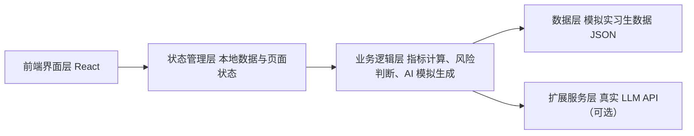
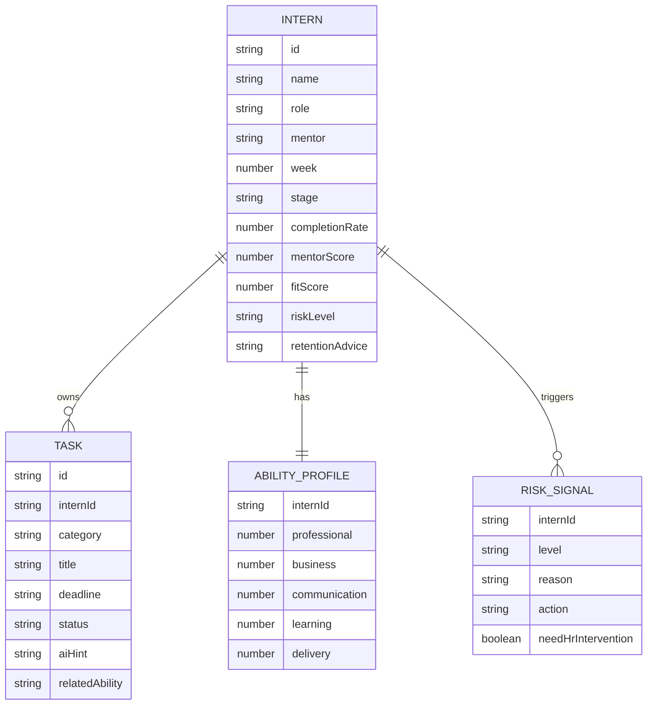

## 1. 架构设计


## 2. 技术说明
- 前端：React 18 + TypeScript + Vite
- 样式：Tailwind CSS 3 + 自定义 CSS 变量
- 图表：Recharts，用于雷达图、柱状图、趋势与分布展示
- 图标：Lucide React
- 数据：本地静态模拟数据文件，覆盖 20 名实习生与角色视图
- AI 能力：默认使用本地规则和预设输出模板模拟，可扩展为真实 LLM 接口
- 部署：Vercel

## 3. 路由定义
| 路由 | 作用 |
|------|------|
| / | 首页与角色入口 |
| /intern | 实习生端成长导航 |
| /mentor | 导师端带教工作台 |
| /hr | HR 整体适岗看板 |
| /ai-center | AI 助手中心 |

## 4. API 定义（可选扩展）
当前最小可行 Demo 默认不依赖后端 API，所有数据由前端本地维护。若后续切换真实 AI，可补充以下接口。

```ts
export type WeeklyReportInput = {
  completed: string
  blockers: string
  learned: string
  nextWeek: string
}

export type AiReportResponse = {
  summary: string
  highlights: string[]
  risks: string[]
  suggestions: string[]
  riskLevel: '低' | '中' | '高'
}

export type MentorFeedbackInput = {
  role: string
  completionRate: number
  abilityScores: Record<string, number>
  reportSummary: string
  mentorNote: string
}

export type MentorFeedbackResponse = {
  strengths: string[]
  improvements: string[]
  nextActions: string[]
  fullFeedback: string
}
```

## 5. 数据模型
### 5.1 数据模型定义


### 5.2 数据定义说明
- `interns`：20 名实习生主数据，包含岗位、周数、完成率、适岗指数、风险等级等
- `tasks`：实习生任务列表，按学习、业务、协作三类拆分
- `abilities`：能力雷达图评分数据
- `mentorAlerts`：导师端提醒数据
- `hrSummary`：HR 看板汇总指标与岗位分布数据
- `aiExamples`：AI 助手中心的预设问题与示例输出

## 6. 核心业务规则
- 成长阶段配置：
  - 第 1 周为认知期
  - 第 2 至 4 周为上手期
  - 第 5 至 8 周为进阶期
  - 第 9 周后为评估期
- 适岗指数计算：
  - 任务完成度 * 30%
  - 导师评价 * 25%
  - 能力成长速度 * 20%
  - 主动学习表现 * 15%
  - 沟通协作反馈 * 10%
- 风险预警逻辑：
  - 任务完成率低于 60% 记为风险信号
  - 周报出现“迷茫、压力大、不知道、跟不上”等词记为风险信号
  - 连续 2 周未反馈、连续延期 2 次以上、沟通频率低均触发提醒
  - 单项异常为中风险，多项异常为高风险

## 7. 实现策略
- 第一阶段采用前端纯静态实现，确保页面完整、交互清晰、部署简单
- AI 输出使用模板拼装与模拟文本，重点展示业务逻辑和可解释性
- 页面之间共享同一份数据源，保证首页、实习生端、导师端、HR 端的数据口径一致
- 后续如配置 OpenAI / OpenRouter / Gemini，可在 `services/ai.ts` 中替换为真实调用

## 8. 部署与交付
- 使用 Vite 构建静态站点并部署到 Vercel
- 输出公网访问链接用于作业提交与录屏演示
- 保留模拟数据与 Prompt 文案，方便在答辩时说明 AI 工具选型与业务闭环
